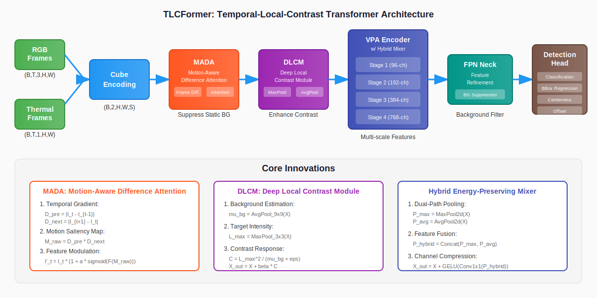

# TLCFormer: 融合时域运动与局部对比度的鲁棒红外视频小目标检测

[](https://opensource.org/licenses/MIT)
[](https://pytorch.org/)
[](https://github.com/topics/infrared-small-target-detection)
[](https://www.python.org/downloads/)

[**English Version**](README.md)

> **论文官方 PyTorch 实现** *"TLCFormer: Synergizing Temporal Motion and Local Contrast for Robust Infrared Video Small Object Detection"*

## 📖 简介

**TLCFormer** (Temporal-Local-Contrast Transformer) 是一个专为 **复杂背景下红外视频小目标检测** 设计的单阶段 Transformer 模型。

针对现有方法（如 OSFormer）在强背景噪声（云层边缘、地面杂波）下检测失效，以及小目标特征在深层网络中被淹没的问题，我们提出了三个物理先验引导机制：

1. **MADA（运动感知差分注意力）**: 利用多帧差分捕捉运动先验，抑制静态背景
2. **DLCM（深度局部对比度模块）**: 基于局部对比度原理增强高频小目标特征
3. **混合能量保持混合器**: 替代传统 AvgPool，防止下采样过程中小目标能量丢失

## 🏗️ 网络架构

<p align="center">
  
</p>

TLCFormer 处理流程：
- **立方体编码**: RGBT 多模态融合与时序采样
- **MADA**: 运动感知背景抑制
- **DLCM**: 局部对比度增强
- **VPA 编码器**: 带混合混合器的多尺度特征提取
- **检测头**: 用于边界框预测的序列回归

## 🚀 核心创新点

### 1. 运动感知差分注意力 (MADA)

不同于 OSFormer 的 FFT 多普勒滤波（易受高频噪声干扰），MADA 显式利用**时间帧差分**：

```
D_pre = |I_t - I_{t-1}|        # 前向差分
D_next = |I_{t+1} - I_t|       # 后向差分
M_raw = D_pre ⊙ D_next         # 哈达玛积
A_motion = σ(F_motion(M_raw))  # 运动注意力
I'_t = I_t · (1 + α · A_motion) # 特征调制
```

生成动态运动掩码，强制网络关注运动区域，有效过滤静止云层和地面纹理。

### 2. 深度局部对比度模块 (DLCM)

引入红外物理领域的经典**局部对比度**理论：

```
μ_bg = AvgPool_{K_out}(X)      # 背景估计
L_max = MaxPool_{K_in}(X)       # 目标强度
C = L_max² / (μ_bg + ε)         # 对比度响应
X_out = X + β · C               # 自适应融合
```

在早期特征提取阶段增强目标-背景对比度，防止微弱目标在进入主干网络前丢失。

### 3. 混合能量保持混合器

重构 VPA（变尺寸块注意力）中的 Token Mixer：

| 版本 | 池化方式 | 问题 |
|------|---------|------|
| **OSFormer** | 仅 AvgPool | 点状目标被周围背景平均化 |
| **TLCFormer** | Max-Mean 混合 | MaxPool 保留极值；AvgPool 维持纹理 |

```python
P_max = MaxPool2d(X, k, s)
P_avg = AvgPool2d(X, k, s)
P_hybrid = Concat(P_max, P_avg)
X_mixed = GELU(Conv1x1(P_hybrid))
X_out = X + X_mixed  # 残差连接
```

通过在网络层中保持峰值能量，显著提升小目标**召回率**。

## 🛠️ 环境安装

### 环境要求
- Python 3.8+
- PyTorch 1.12+
- CUDA 11.3+（推荐）

```bash
# 1. 克隆仓库
git clone https://github.com/snow-wind-001/TLCFormer.git
cd TLCFormer

# 2. 创建虚拟环境
conda create -n tlcformer python=3.8
conda activate tlcformer

# 3. 安装依赖
pip install -r requirements.txt
```

## 📁 项目结构

```
TLCFormer/
├── models/
│   ├── osformer.py      # TLCFormer 主模型
│   ├── mada.py          # 运动感知差分注意力
│   ├── dlcm.py          # 深度局部对比度模块
│   ├── vpa.py           # 带混合混合器的 VPA
│   ├── cube_encoding.py # 多模态立方体编码
│   └── neck.py          # 特征精炼颈部
├── utils/
│   └── loss.py          # 损失函数（Focal, CIoU 等）
├── paper/
│   ├── tlcformer.tex    # LaTeX 论文源码
│   ├── tlcformer.pdf    # 编译后论文（9页）
│   └── figures/         # 架构图
├── verify_model.py      # 模型验证脚本
├── requirements.txt     # 依赖包
├── CHANGELOG.md         # 版本历史
├── README.md            # 英文说明
└── README_CN.md         # 中文说明（本文件）
```

## 🚂 使用方法

### 模型初始化

```python
from models import TLCFormer, TLCFormerConfig

# 创建配置
config = TLCFormerConfig(
    num_frames=3,
    embed_dim=256,
    use_mada=True,      # 启用 MADA
    use_dlcm=True,      # 启用 DLCM
    mada_alpha=0.5,     # MADA 缩放因子
    dlcm_beta=0.3,      # DLCM 增强权重
)

# 初始化模型
model = TLCFormer(config)
model.cuda()
```

### 前向传播

```python
import torch

# 输入：RGB 和热红外视频帧
rgb_frames = torch.randn(2, 3, 3, 512, 512).cuda()      # [B, T, C, H, W]
thermal_frames = torch.randn(2, 3, 1, 512, 512).cuda()  # [B, T, 1, H, W]

# 前向传播
outputs = model(rgb_frames, thermal_frames)

# 输出：每个尺度的分类、边界框、中心度
for key, value in outputs.items():
    print(f"{key}: {value.shape}")
```

### 模型验证

```bash
# 运行全面的模型测试
python verify_model.py
```

该脚本验证：
- 各模块功能（MADA, DLCM, HybridMixer）
- 完整模型前向/反向传播
- 使用模拟数据的训练循环

## 📊 损失函数

TLCFormer 使用多任务损失：

```python
L_total = λ_cls · L_focal + λ_bbox · L_ciou + λ_center · L_bce
```

| 损失 | 用途 | 权重 |
|------|------|------|
| 加权 Focal Loss | 处理类别不平衡的分类 | 1.0 |
| CIoU Loss | 边界框回归 | 2.0 |
| BCE Loss | 中心度预测 | 1.0 |

## 📄 论文

完整论文位于 `paper/tlcformer.pdf`（9页，ICML 2026 格式）。

主要内容：
- MADA、DLCM 和混合混合器的详细数学推导
- 能量保持引理证明
- 全面的实验分析

## 📈 实验结果

*即将发布：NUDT-SIRST、IRSTD-1k 及自定义数据集上的基准测试结果*

## 🔧 配置选项

| 参数 | 默认值 | 描述 |
|------|--------|------|
| `num_frames` | 3 | 时序帧数 |
| `embed_dim` | 256 | 特征嵌入维度 |
| `use_mada` | True | 启用 MADA 模块 |
| `use_dlcm` | True | 启用 DLCM 模块 |
| `mada_alpha` | 0.5 | MADA 注意力缩放 |
| `dlcm_beta` | 0.3 | DLCM 对比度权重 |
| `use_doppler` | False | 旧版多普勒滤波器（MADA 启用时禁用）|

## 📝 引用

如果您发现本工作有帮助，请引用：

```bibtex
@inproceedings{tlcformer2026,
  title={TLCFormer: Synergizing Temporal Motion and Local Contrast for Robust Infrared Video Small Object Detection},
  author={Anonymous},
  booktitle={Proceedings of ICML},
  year={2026}
}
```

## 📜 许可证

本项目采用 MIT 许可证 - 详见 [LICENSE](LICENSE) 文件。

## 🙏 致谢

- 基于 [OSFormer](https://github.com/xxx/OSFormer) 的研究成果
- 受经典红外小目标检测方法（LCM, MPCM）启发
- 感谢 PyTorch 团队提供的优秀深度学习框架

## 📬 联系方式

如有问题或合作意向，请提交 Issue 或通过邮件联系。

---

**如果觉得有帮助，请点个 Star ⭐！**
